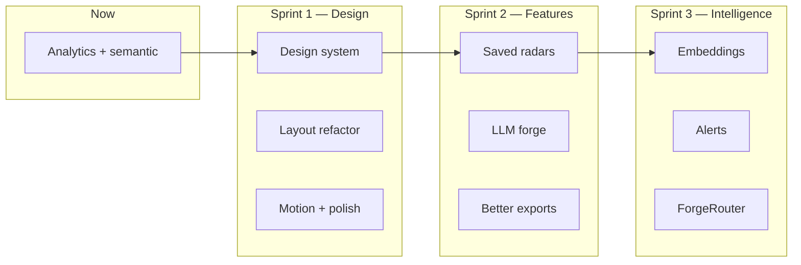

# TrendForge — Improvement Plan & Grok Build Prompts

**Updated:** 2026-07-08  
**Live:** https://trendforge-opal.vercel.app  
**Stack:** React 19, Vite 8, Tailwind 4, Recharts, Framer Motion, Vercel serverless

---

## Current state (after Phase 1)

| Area | Status |
|------|--------|
| Real X proxy | ✅ Production + bearer |
| Velocity shift signals | ✅ |
| Analytics sidebar | ✅ Theme freq, sentiment hist, rising clusters |
| Semantic clustering (tf-idf) | ✅ For "Other" bucket |
| MCP setup scripts | ✅ `scripts/`, `SETUP.md` |
| Design | ⚠️ Functional HUD — needs polish |

---

## Roadmap overview



---

## Sprint 1 — Futuristic UI redesign (Grok Build)

**Goal:** Modern, forward-thinking command-center aesthetic. Keep dark theme + red accent DNA; elevate typography, spacing, glass depth, and micro-interactions.

### Design direction

- **Vibe:** Mission control / signal intelligence — not generic SaaS
- **Palette:** Deep black `#050508`, panels `rgba(12,12,18,0.85)`, accent `#e6002e`, cyan `#00e5ff`, green `#00ff88`
- **Typography:** Display: **Space Grotesk** or **Syne**; HUD/metrics: **JetBrains Mono**
- **Effects:** Subtle grid + radial glow, glassmorphism panels, 1px gradient borders, scan-line optional
- **Layout:** Sticky header with status pills; 3-column dashboard; collapsible analytics drawer on mobile

### Grok Build Prompt #1 — Design system + tokens

```
Project: TrendForge (React 19 + Vite + Tailwind 4)
Path: /Users/drewmax/projects/trendforge

Task: Create a cohesive futuristic design system without changing business logic.

1. Add Google fonts (Space Grotesk + JetBrains Mono) in index.html
2. Extend src/index.css with CSS variables:
   - --bg, --panel, --panel-glass, --border, --border-glow
   - --accent, --cyan, --green, --text, --muted
   - --radius-sm/md/lg, --shadow-glow
3. Create src/components/ui/ with reusable primitives:
   - Panel.tsx (glass panel with optional glow border)
   - HudLabel.tsx (uppercase mono label)
   - NeoButton.tsx (replace inline neo-btn classes)
   - StatPill.tsx (metric chip for header)
   - GlowDivider.tsx
4. Do NOT rewrite App.tsx logic — only swap classNames to use new components
5. Keep existing color accent #e6002e
6. Mobile: stack columns, sticky bottom action bar for SYNC REAL X + FORGE

Match existing file conventions. Run npm run build && npm run lint before finishing.
```

### Grok Build Prompt #2 — Header + layout refactor

```
Project: TrendForge — src/App.tsx is ~430 lines

Task: Refactor layout into components while preserving all handlers/state in App.tsx.

Extract:
- src/components/Header.tsx — logo, tagline, feed controls (pause, reset, live real, export)
- src/components/FeedPanel.tsx — search, post list, sync/test buttons
- src/components/ClusterPanel.tsx — cluster cards with shift badges
- src/components/InsightsPanel.tsx — insights list
- src/components/ForgePanel.tsx — forge, sparks, grok prompt
- src/components/VolumeChart.tsx — recharts timeline

Design:
- Header: horizontal status bar with pulsing LIVE dot, connection status (mock/real/live)
- Add subtle framer-motion page enter + staggered card reveals
- Cluster cards: gradient left border by shift intensity
- Post cards: avatar placeholder circle, improved typography hierarchy

Pass all props/callbacks from App — no duplicated state.
npm run build must pass.
```

### Grok Build Prompt #3 — Motion + empty states

```
TrendForge — add polish only, no new features.

1. Empty states:
   - Feed empty: "Awaiting signals…" with animated radar sweep SVG
   - Chart collecting: skeleton shimmer
   - No rising clusters: helpful hint to wait or SYNC REAL X

2. Motion (framer-motion):
   - New posts slide in from top
   - Cluster selection: layoutId highlight ring
   - Toast-adjacent micro-feedback on forge copy

3. Accessibility:
   - Focus rings on buttons
   - aria-labels on icon-only buttons
   - prefers-reduced-motion: disable infinite animations

Files: src/components/*, src/App.tsx (minimal)
```

---

## Sprint 2 — Useful features (Grok Build)

### Grok Build Prompt #4 — Saved radars

```
TrendForge — add persistent saved search radars.

Requirements:
1. src/lib/radars.ts — CRUD in localStorage: { id, name, query, createdAt, lastSynced? }
2. src/components/RadarManager.tsx — list saved queries, add/delete, "Sync" button
3. Wire sync to existing fetchRealPosts(query) + mergePosts
4. Config: max 5 radars, default queries from src/config.json
5. UI: compact dropdown or sidebar section under feed panel
6. Export radar state in JSON export

Types in src/lib/types.ts. Pure functions testable. No new npm deps.
```

### Grok Build Prompt #5 — LLM content forge (ForgeRouter-ready)

```
TrendForge — upgrade forgeContent to support optional LLM backend.

1. src/lib/forge.ts — keep template forgeContent, add:
   - buildForgePrompt(cluster, sparks, insights) → string
   - parseForgeResponse(text) → string[]
2. src/components/ForgePanel.tsx — add:
   - Toggle: "Templates" | "LLM" (LLM disabled until URL set)
   - Input: ForgeRouter URL (localStorage key trendforge-forge-url)
   - POST to {url}/v1/chat/completions or copy prompt button
3. Show loading skeleton during LLM call
4. Fallback to templates on error

Do not add API keys to repo. URL is user-local only.
```

### Grok Build Prompt #6 — Export bundle v2

```
TrendForge — improve export to timestamped bundle.

1. exportBundle() downloads a .zip or sequential files:
   - thread.md (existing format)
   - meta.json (sidecar + cluster stats + radar name if any)
   - signals.json (raw posts in selected cluster)
2. Use JSZip if needed (add dep) OR trigger 3 sequential downloads with shared timestamp prefix
3. Button: "DOWNLOAD BUNDLE" replaces or sits beside existing MD button
4. Filename: trendforge-{topic-slug}-{ISO-date}/

Keep backward compatible with existing exportMarkdownThread.
```

---

## Sprint 3 — Intelligence (Grok Build / local)

### Grok Build Prompt #7 — Browser embeddings clustering

```
TrendForge — optional semantic upgrade using @xenova/transformers.

1. Add @xenova/transformers as dependency
2. src/lib/embeddings.ts — lazy-load MiniLM, embed post texts, k-means or agglomerative cluster
3. Feature flag in config.json: "useEmbeddings": false (default off — heavy)
4. When true, replace clusterPostsSemantically for Other bucket OR all posts
5. Web worker if possible to avoid blocking UI
6. Loading indicator: "Initializing semantic engine…"

Fallback to existing tf-idf in src/lib/semantic.ts on failure.
Document model download size in SETUP.md.
```

### Grok Build Prompt #8 — API error UX

```
TrendForge — human-readable proxy errors in UI.

1. api/x-search.js — parse X API JSON errors, return:
   { error, code, hint } e.g. credits-depleted → hint about billing
2. src/lib/feed.ts — map error codes to toast messages:
   - X_BEARER_TOKEN not configured
   - credits depleted (402)
   - invalid max_results
   - rate limit 429
3. Header status pill: green "X CONNECTED" | amber "MOCK" | red "X ERROR"

No secrets in error messages.
```

---

## Local tasks (you / Cursor — no Grok Build)

| Task | Effort | Notes |
|------|--------|-------|
| Code-split Recharts | 1h | dynamic import AnalyticsSidebar + VolumeChart |
| Connect Git → Vercel auto-deploy | 15m | vercel.link/git |
| Update `.env.example` prod callback URL | 5m | trendforge-opal.vercel.app |
| Unit tests for analytics + semantic | 2h | vitest, pure functions only |
| Slice `max_results` in proxy response | 30m | honor caller's limit after X fetch |

---

## Suggested execution order

1. **Grok Build #1** — Design system (foundation)
2. **Grok Build #2** — Layout refactor
3. **Grok Build #8** — Error UX (quick win)
4. **Grok Build #3** — Motion polish
5. **Grok Build #4** — Saved radars
6. **Grok Build #5** — LLM forge
7. **Grok Build #6** — Export bundle
8. **Grok Build #7** — Embeddings (optional/heavy)

---

## Grok Build session tips

- Open project root: `/Users/drewmax/projects/trendforge`
- Connect **xapi MCP** for live X testing
- One prompt per session — review diff before next
- Always run: `npm run lint && npm run build`
- Deploy: `npx vercel --prod`

---

## Success criteria

- [ ] Site feels like a 2026 signal intelligence tool, not a hackathon demo
- [ ] Real X flow obvious: status pill + clear errors
- [ ] Saved radars reduce repetitive query entry
- [ ] Forge output shippable in < 2 clicks
- [ ] Bundle export works for MakerLog / downstream tools
- [ ] Lighthouse: no regression on LCP (code-split charts)
