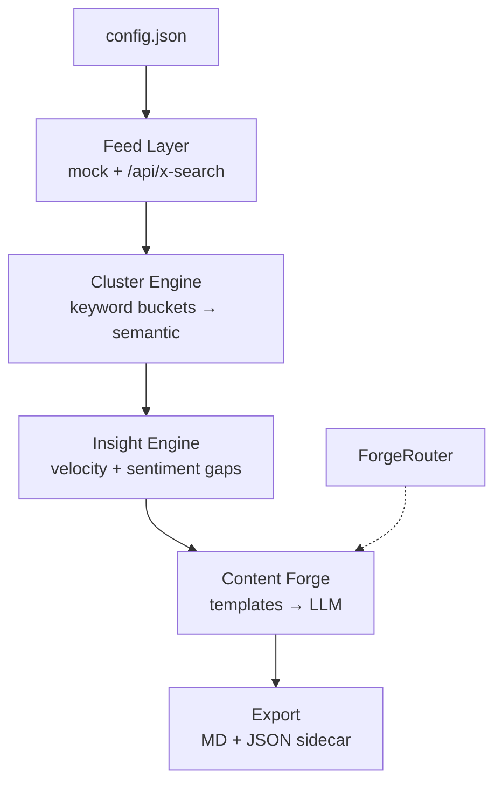

# TrendForge — Master Roadmap

**Last updated:** 2026-07-08  
**Production:** https://trendforge-opal.vercel.app  
**Status:** Functional prototype → intelligence upgrade

## Vision

Real-time X trend radar that detects emerging narratives before they peak, then forges unique content angles you can ship immediately. Local-first friendly; composable via JSON sidecar.

## Current State (Phase 0 complete)

- [x] End-to-end flow: feed → cluster → insights → forge → export
- [x] Real X proxy (`/api/x-search`) with server-side bearer
- [x] Markdown thread + JSON sidecar export
- [x] Pure helpers in `src/lib/`
- [x] Config file for buckets, queries, poll intervals
- [x] Velocity-based shift (replaces random)
- [x] Git + MIT license

## Phase 1 — Signal Quality (1–2 weeks)

| Item | Priority | Notes |
|------|----------|-------|
| Analytics sidebar | High | Theme freq, sentiment histogram, rising clusters |
| Semantic clustering spike | High | `@xenova/transformers` or tf-idf + cosine |
| Persistent radars | Medium | Saved searches + localStorage/IndexedDB |
| Better sentiment | Medium | Move heuristic to shared lib; optional LLM pass |

## Phase 2 — Intelligence (2–4 weeks)

| Item | Priority | Notes |
|------|----------|-------|
| ForgeRouter integration | High | Wire `forgeContent` to local LLM gateway |
| Grok/xapi MCP automation | Medium | Beyond clipboard — optional API hook |
| Velocity alerts | Medium | Notify when cluster crosses threshold |
| Multi-query radars | Medium | Parallel searches, merged feed |

## Phase 3 — Productization

| Item | Priority | Notes |
|------|----------|-------|
| Vercel deploy hardening | High | Env-only tokens, no client bearer in prod |
| Full bundle export | Medium | Timestamped dir: thread.md, meta.json, images/ |
| MakerLog / InsightForge handoff | Medium | JSON sidecar is the contract |
| Code-split Recharts | Low | Reduce 700KB bundle |

## Architecture



## Composability Contract

JSON sidecar shape (stable):

```json
{
  "topic": "AI Agents",
  "volume": 12,
  "sentiment": "0.40",
  "forged": ["Hook: ...", "Thread: ..."],
  "sparks": ["Prototype a narrow agent..."],
  "timestamp": "2026-07-07T..."
}
```

Feed to MakerLog, InsightForge, or any synthesis pipeline.

## Success Metrics

- Time to first forged thread: < 3 minutes (mock), < 5 minutes (real X)
- Cluster accuracy: subjective — "did this catch the real conversation?"
- Export usability: thread posts to X/LinkedIn without editing
