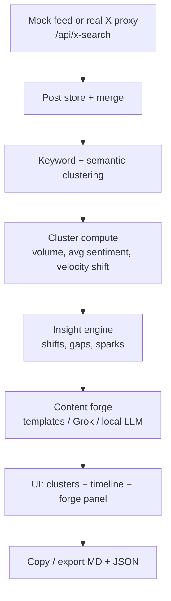

# TrendForge

**Real-time X trend radar + content forge.** Detect emerging narratives, gaps, and sentiment shifts on X, then forge original, timely angles, threads, and sparks you can ship — without drowning in the "sea of sameness".

**Live:** https://trendforge-opal.vercel.app

TrendForge ingests X posts (mock or real), clusters them into conversation buckets, surfaces volume/sentiment/velocity signals and content gaps, and helps you draft platform-ready copy. It runs happily with **zero keys** on a simulated feed, and upgrades to real X data and LLM-assisted drafting when you configure server-side secrets.

---

## Run locally (no keys required)

The default experience is fully local and keyless — it ingests a simulated X feed so you can explore clustering, insights, and the forge in under three minutes.

```bash
git clone https://github.com/M0xDr3w/trendforge.git
cd trendforge
npm install
npm run dev
```

Open the printed local URL (default http://localhost:5173). The feed auto-ingests mock posts. Click a cluster → **Forge** to generate angles, then copy or export. No X or LLM credentials are needed for this path — template-based forging works entirely offline.

### Verify

```bash
npm run lint    # oxlint
npm run test    # vitest
npm run build   # tsc + vite production build
```

---

## Stack

- **Frontend:** React 19 + TypeScript, built with Vite
- **Styling:** Tailwind CSS 4 (dark HUD UI), Framer Motion, Recharts, Lucide, Sonner
- **Backend:** Vercel serverless functions (Node.js runtime)
  - `api/x-search.js` — secure X recent-search proxy
  - `api/forge-chat.js` — server-side xAI Grok proxy (OpenAI-compatible)
- **Node:** 22.x

Domain logic lives as pure, tested helpers in `src/lib/` (clustering, insights, forge templates, analytics, export). `App.tsx` stays as orchestration.

---

## Real X data (Sync) — server-side, under a spend cap

The **SYNC REAL X** / **LIVE REAL** actions call the `/api/x-search` serverless proxy, which fetches from X's recent-search API. Real X data is opt-in and gated by a server-side budget:

- The X bearer token lives **only** in server env (`X_BEARER_TOKEN`), never in the client bundle.
- The proxy enforces a **monthly spend cap** — `X_SPEND_CAP_USD` (default `$20`) — tracked in Vercel KV (`KV_REST_API_URL`, `KV_REST_API_TOKEN`). When the cap is reached, the proxy returns a structured `spend_cap` error and stops spending until the next month or until you raise the cap. Without KV configured, the cap cannot be enforced and real-search is refused (`spend_store_missing`), so you can't accidentally run uncapped.
- Prefer an **App-only Bearer Token** (long-lived) for `X_BEARER_TOKEN`. OAuth 2.0 *user* tokens are short-lived and belong to local MCP/`xurl` flows, not this proxy.

Local dev with real data:

```bash
X_BEARER_TOKEN=<app-only-bearer> npx vercel dev
```

Production: set `X_BEARER_TOKEN` (and the KV vars) in the Vercel dashboard → Environment Variables, then redeploy. See `.env.example` and `SETUP.md` for the full walkthrough. **Never commit tokens** — secrets stay in Vercel env only.

---

## Forge — human-gated, copy-paste, no auto-post

The content forge is deliberately **human-in-the-loop**. TrendForge **never** posts to X automatically:

- Forged hooks, threads, and angles are drafted for you to review, edit, and **copy** — publishing is always a manual paste by you.
- Accept / Edit / Reject choices feed a local learn loop (preferences stored in `localStorage`) that tunes future drafts — they never trigger a post.
- The last forge persists in the UI and flows into Markdown/JSON export.

### Forge intelligence paths

| Path | How | Secret |
|------|-----|--------|
| **Templates** | Always available, fully offline | none |
| **Grok (xAI)** | Forge → Grok preset → `POST /api/forge-chat` | `XAI_API_KEY` (server env / `vercel dev`) |
| **Local** | Forge → Local → Ollama (`:11434`) or ForgeRouter (`:8123`) | none (local) |
| **Custom** | Any OpenAI-compatible base URL | optional session key (sessionStorage only) |

`XAI_API_KEY` is read server-side by `/api/forge-chat` and never ships in the client bundle. An optional UI-pasted key is kept in `sessionStorage` only. If an LLM call fails, the forge falls back to templates.

---

## Architecture



Post processing stays in the browser for speed and privacy; the serverless proxies exist only to keep tokens off the client and to enforce the spend cap.

---

## Configuration

- Keyword buckets and defaults: `src/config.json`
- Domain helpers and tests: `src/lib/*`
- Serverless proxies: `api/x-search.js`, `api/forge-chat.js`

Relevant environment variables (all server-side, set in Vercel or `vercel dev`):

| Variable | Purpose |
|----------|---------|
| `X_BEARER_TOKEN` | X recent-search access (App-only bearer) |
| `X_SPEND_CAP_USD` | Monthly real-X spend cap (default `$20`) |
| `KV_REST_API_URL`, `KV_REST_API_TOKEN` | Vercel KV store used to enforce the spend cap |
| `XAI_API_KEY` | Server-side Grok forge via `/api/forge-chat` |

---

## Project structure

```
trendforge/
├── src/
│   ├── App.tsx            # Orchestration / main UI
│   ├── config.json        # Keyword buckets, defaults
│   ├── components/        # Panels, charts, UI primitives
│   └── lib/               # Pure helpers + tests (clusters, insights, forge, analytics, export)
├── api/
│   ├── x-search.js        # X recent-search proxy (spend-capped)
│   └── forge-chat.js      # xAI Grok proxy (OpenAI-compatible)
└── package.json
```

---

## Contributing

Open source, built in public. Prefer pure functions + tests for domain logic in `src/lib/`. Before opening a PR, run `npm run lint && npm run test && npm run build`. See `AGENTS.md` and `GOALS.md` for operating principles and the ship bar.

## License

MIT — see `LICENSE`.
