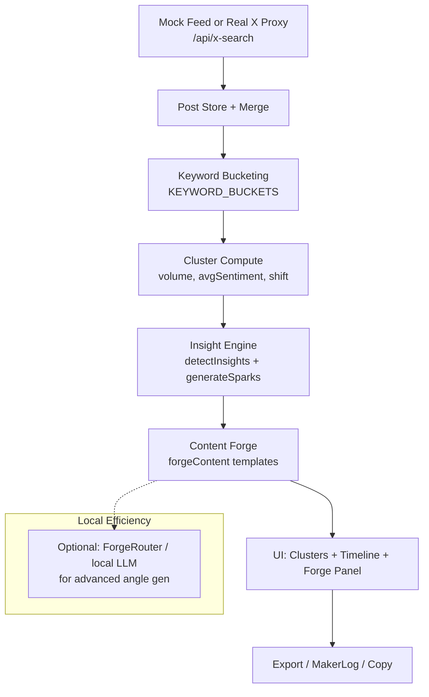

# TrendForge

**Real-Time X Trend Radar + Content Forge**  
Escape the "Sea of Sameness". Detect emerging narratives, gaps, and shifts on X in real time. Forge unique, timely angles, threads, and sparks you can ship immediately.

**Production:** https://trendforge-opal.vercel.app

**Target users:** Indie creators, researchers, builders who want signal over noise and original content fast. Local-first friendly (pair with ForgeRouter for private generation).

## Value Proposition (30 seconds)
- Pull live (or simulated) X posts.
- Cluster by real conversation buckets.
- Spot volume spikes, sentiment flips, and "what's missing".
- One-click generate platform-ready hooks, threads, LinkedIn posts, contrarian takes.
- Export clean Markdown threads + JSON + timestamped artifacts.

Built for speed on your M-series Mac. Real X data via secure proxy or local bearer. Beautiful dark HUD UI.

## Quickstart (< 3 minutes to first useful result)

```bash
cd projects/trendforge
npm install
npm run dev
```

1. Open the local URL.
2. The feed auto-ingests simulated posts (or click **SYNC REAL X** / toggle **LIVE REAL**).
3. Watch clusters form → click a cluster → **Forge Content** or **Sparks**.
4. Copy a thread or export.

**First real data (recommended):**
- Get X Bearer Token (app-only) from developer.x.com.
- `X_BEARER_TOKEN=your_token npx vercel dev` (or set in Vercel env + deploy).
- See "Real X Setup" below.

**Local LLM generation option:** Use ForgeRouter as backend (copy prompts or integrate later).

## Features

- **Live / Real X Feed**: Mock + production-grade recent search via `/api/x-search` proxy (rate-limit aware).
- **Smart Keyword Clustering**: Predefined high-signal buckets (AI Agents, X & Grok, Local/Embeddings, Consumer, Content & Trends, DevTools). Remaining → "Other".
- **Narrative Intelligence**: Volume deltas, sentiment averages, shift/gap/opportunity detection.
- **Content Forge + Sparks**: Ready-to-adapt hooks, threads, contrarian angles, micro-experiments. Pure helpers in `src/lib/insights.ts`.
- **Visuals**: Recharts volume timeline. Cluster cards with metrics.
- **Actions**: Inject custom post, reset, export, persist (local).
- **Multiple Outputs**: In-app copy + planned folder/JSON/MD export (see improvements).
- **Real-time modes**: LIVE REAL toggle (polls conservatively).

## Architecture (Mermaid)



Data flow stays in-browser for speed + privacy. Proxy keeps tokens server-side.

## Real X Setup (Bearer Token) – Updated per 2026 Vercel best practices

1. Create X app at https://developer.x.com (Read access, OAuth 2.0).
2. Copy **Bearer Token** (App-only recommended for search/recent).
3. Local (Fluid Compute): `X_BEARER_TOKEN=xxx npx vercel dev`
4. Prod: `vercel env add X_BEARER_TOKEN` (Production + Preview) or Dashboard. Redeploy.
   - Project now uses `vercel.ts` (modern typed config, see below).
5. In-app: **SYNC REAL X** or **LIVE REAL** toggle.

`/api/x-search` runs on Fluid Compute (full Node.js, instance reuse). Keep token server-side only.

Rate limits respected (polling ~45s in LIVE). See `api/x-search.js` for fields + sentiment heuristic.

MCP / xurl notes in original for advanced auth.

## Configuration & Extensibility

- Keyword buckets: edit `keywordBuckets` in `src/config.json`.
- Mock seeds & generators: `SEED_POSTS`, `generateMockPost`.
- Sparks & forge logic: pure functions in `src/lib/insights.ts` (importable elsewhere).
- Future: extend `src/config.json` for queries, poll interval, export dir.

## Local Hardware & Models

- Runs great on M1/M-series (Vite dev is light).
- For private angle generation: run ForgeRouter (`forgerouter serve`) and feed forged prompts to it (or copy outputs).
- Recommended local models via ForgeRouter: Qwen3-8B-4bit, Gemma-7B-4bit, Phi-4-mini (see ForgeRouter README).
- No GPU required for the dashboard itself.

## Example Output (Forge)

**Cluster:** "AI Agents" (volume 12, sentiment +0.4)

**Forged:**
- Hook: Everyone is wrong about AI Agents — here's the angle no one is writing.
- Thread starter: 1/ The AI Agents narrative just flipped. Here's what changed...
- Contrarian: AI Agents isn't exploding — it's maturing. Here's how to play the next phase.
- Sparks: Prototype a narrow agent that automates one repetitive step...

Export as Markdown thread ready for X/LinkedIn.

## Project Structure (key)

```
trendforge/
├── src/
│   ├── App.tsx          # Main UI
│   ├── config.json      # Buckets, poll intervals, queries
│   ├── lib/
│   │   ├── clusters.ts  # Keyword clustering + velocity shift
│   │   ├── feed.ts      # Mock/real X fetch + merge
│   │   ├── narrative.ts # Insights + content forge
│   │   └── insights.ts  # Sparks + velocity helpers
│   └── ...
├── api/x-search.js      # Vercel serverless proxy for real X
├── public/              # static
└── package.json
```

## Current Status & Limitations (2026-07-05)

Functional end-to-end: live feed → cluster → insights → forge → export.

**Current intelligence layer:** Rule/keyword based (fast, no deps).  
**Next leverage:** Semantic clustering (embeddings via transformers.js or server) + LLM angle generation (local via ForgeRouter or Grok).

See inline comments for recent: real X merge behavior, sparks, persistence.

## Improvements Made in This Review
- Stronger README with quickstart, architecture diagram, example, local notes, config hints.
- .gitignore hardened (secrets, builds).
- MIT LICENSE added.
- Inventory + roadmap alignment.

## Next Actions (from roadmap)
See MASTER_ROADMAP.md. High-ROI:
- Semantic clustering + better velocity signals.
- Export formats (MD thread file + images folder + JSON).
- Simple analytics panel (theme distribution).
- Config file / CLI flags for queries.
- Handoff to InsightForge-style or MakerLog.

## Run / Build

```bash
npm run dev
npm run build
npm run preview
npm run lint
```

## License

MIT — see LICENSE.

Built for momentum and real usefulness on the edge.
