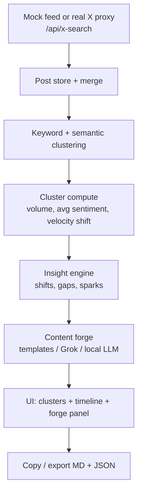

# TrendForge — Bookmark Forge

**Turns what you already save on X into a weekly brief and ready-to-edit threads.** Sign in with X,
sync your bookmarks, see what you've been saving about, get a Grok weekly brief, and forge
citation-grounded thread ideas — copy, never auto-post.

**Live:** https://trendforge-opal.vercel.app

Alongside bookmarks, TrendForge keeps a secondary "what's moving now" panel: real-time X trend radar
+ content forge. Detect emerging narratives, gaps, and sentiment shifts on X, then forge original,
timely angles, threads, and sparks you can ship — without drowning in the "sea of sameness".

TrendForge ingests X posts (sample data, real recent search, or your own bookmarks), clusters them
into conversation buckets, surfaces volume/sentiment/velocity signals and content gaps, and helps you
draft platform-ready copy. It runs happily with **zero keys** on clearly labeled sample data, and
upgrades to real X data and LLM-assisted drafting when you configure server-side secrets.

---

## Run locally (no keys required)

The default experience is fully local and keyless — it ingests clearly labeled **sample data**
(fictional `@sample_*` accounts with invented counts, badged `SAMPLE DATA` in the feed) so you can
explore clustering, insights, and the forge in under three minutes. Sample posts never claim to be
real X accounts or real engagement.

```bash
git clone https://github.com/M0xDr3w/trendforge.git
cd trendforge
npm install
npm run dev
```

Open the printed local URL (default http://localhost:5173). The feed auto-ingests mock posts. Click a cluster → **Forge** to generate angles, then copy or export. No X or LLM credentials are needed for this path — template-based forging works entirely offline.

### Verify

```bash
npm run lint    # oxlint
npm run test    # vitest
npm run build   # tsc + vite production build
```

---

## Stack

- **Frontend:** React 19 + TypeScript, built with Vite
- **Styling:** Tailwind CSS 4 (dark HUD UI), Framer Motion, Recharts, Lucide, Sonner
- **Backend:** Vercel serverless functions (Node.js runtime)
  - `api/x-search.js` — secure X recent-search proxy
  - `api/forge-chat.js` — server-side xAI Grok proxy (OpenAI-compatible)
- **Node:** 24.x (matches the Vercel project runtime)

Domain logic lives as pure, tested helpers in `src/lib/` (clustering, insights, forge templates, analytics, export). `App.tsx` stays as orchestration.

---

## Real X data (Sync) — server-side, under a spend cap

The **SYNC REAL X** / **LIVE REAL** actions call the `/api/x-search` serverless proxy, which fetches from X's recent-search API. Real X data is opt-in and gated by a server-side budget:

- The X bearer token lives **only** in server env (`X_BEARER_TOKEN`), never in the client bundle.
- Both proxies accept **same-origin requests only** — the browser's `Origin`/`Referer` must match
  the deployment host (override with `APP_ORIGIN` if fronted differently). Bare curl and
  third-party sites get `origin_forbidden`.
- Optional owner lockdown: set `APP_ACCESS_TOKEN` server-side and paste the same value in the
  feed panel's session field (sent as `x-app-token`, kept in `sessionStorage` only). When unset,
  the proxies stay usable from the app with no login.
- Per-IP rate limits sit in front of the shared budget — `X_SEARCH_PER_HOUR` (default `60`) and
  `FORGE_CHAT_PER_HOUR` (default `30`) — enforced with Vercel KV when configured, best-effort
  in-memory otherwise.
- `/api/forge-chat` additionally enforces a server-side model allowlist (`FORGE_ALLOWED_MODELS`,
  default `grok-4.5,grok-4,grok-3`) and caps `max_tokens` at `FORGE_MAX_TOKENS` (default `1000`,
  absolute ceiling `2000`). Caller-supplied models and token counts outside those bounds are
  clamped, not honored.
- The proxy enforces a **monthly spend cap** — `X_SPEND_CAP_USD` (default `$20`) — tracked in Vercel KV (`KV_REST_API_URL`, `KV_REST_API_TOKEN`). When the cap is reached, the proxy returns a structured `spend_cap` error and stops spending until the next month or until you raise the cap. Without KV configured, the cap cannot be enforced and real-search is refused (`spend_store_missing`), so you can't accidentally run uncapped.
- Prefer an **App-only Bearer Token** (long-lived) for `X_BEARER_TOKEN`. OAuth 2.0 *user* tokens are short-lived and belong to local MCP/`xurl` flows, not this proxy.

Local dev with real data:

```bash
X_BEARER_TOKEN=<app-only-bearer> npx vercel dev
```

Production: set `X_BEARER_TOKEN` (and the KV vars) in the Vercel dashboard → Environment Variables, then redeploy. See `.env.example` and `SETUP.md` for the full walkthrough. **Never commit tokens** — secrets stay in Vercel env only.

---

## Forge — human-gated, copy-paste, no auto-post

The content forge is deliberately **human-in-the-loop**. TrendForge **never** posts to X automatically:

- Forged hooks, threads, and angles are drafted for you to review, edit, and **copy** — publishing is always a manual paste by you.
- Accept / Edit / Reject choices feed a local learn loop (preferences stored in `localStorage`) that tunes future drafts — they never trigger a post.
- The last forge persists in the UI and flows into Markdown/JSON export.

### Forge intelligence paths

| Path | How | Secret |
|------|-----|--------|
| **Templates** | Always available, fully offline | none |
| **Grok (xAI)** | Forge → Grok preset → `POST /api/forge-chat` | `XAI_API_KEY` (server env / `vercel dev`) |
| **Local** | Forge → Local → Ollama (`:11434`) or ForgeRouter (`:8123`) | none (local) |
| **Custom** | Any OpenAI-compatible base URL | optional session key (sessionStorage only) |

`XAI_API_KEY` is read server-side by `/api/forge-chat` and never ships in the client bundle. An optional UI-pasted key is kept in `sessionStorage` only. If an LLM call fails, the forge falls back to templates.

---

## Architecture


```mermaid
flowchart TD
    A[Mock feed or real X proxy<br/>/api/x-search] --> B[Post store + merge]
    B --> C[Keyword + semantic clustering]
    C --> D[Cluster compute<br/>volume, avg sentiment, velocity shift]
    D --> E[Insight engine<br/>shifts, gaps, sparks]
    E --> F[Content forge<br/>templates / Grok / local LLM]
    F --> G[UI: clusters + timeline + forge panel]
    G --> H[Copy / export MD + JSON]
```

Post processing stays in the browser for speed and privacy; the serverless proxies exist only to keep tokens off the client and to enforce the spend cap.

---

## Configuration

- Keyword buckets and defaults: `src/config.json`
- Domain helpers and tests: `src/lib/*`
- Serverless proxies: `api/x-search.js`, `api/forge-chat.js`

Relevant environment variables (all server-side, set in Vercel or `vercel dev`):

| Variable | Purpose |
|----------|---------|
| `X_BEARER_TOKEN` | X recent-search access (App-only bearer) |
| `X_SPEND_CAP_USD` | Monthly real-X spend cap (default `$20`) |
| `KV_REST_API_URL`, `KV_REST_API_TOKEN` | Vercel KV store used to enforce the spend cap + proxy rate limits |
| `XAI_API_KEY` | Server-side Grok forge via `/api/forge-chat` |
| `APP_ACCESS_TOKEN` | Optional: when set, proxy calls must send it as `x-app-token` (owner lockdown; unset = same-origin + rate limits only) |
| `APP_ORIGIN` | Optional: comma-separated allowed hosts/URLs for the same-origin check (default: derive from request host) |
| `FORGE_ALLOWED_MODELS` | Optional: comma-separated xAI model allowlist (default `grok-4.5,grok-4,grok-3`) |
| `FORGE_MAX_TOKENS` | Optional: per-request `max_tokens` cap for `/api/forge-chat` (default `1000`, ceiling `2000`) |
| `X_SEARCH_PER_HOUR` / `FORGE_CHAT_PER_HOUR` | Optional: per-IP hourly rate limits (defaults `60` / `30`) |
| `X_CLIENT_ID`, `X_CLIENT_SECRET` | X OAuth app credentials for Sign in with X (server only, never the client) |
| `SESSION_SECRET` | 16+ char secret sealing bookmark sessions server-side (AES-256-GCM + KV) |
| `CRON_SECRET` | Bearer secret protecting `/api/cron/weekly-digest` |
| `X_BOOKMARK_COST_USD` | Optional: per-post bookmark-read cost (default `$0.001`; use `X_USER_OWNS_APP=false` for `$0.005`) |
| `X_USER_OWNS_APP` | Set `false` when the X developer app belongs to someone else (bookmark reads cost `$0.005`/post) |

---

## Bookmark Forge (primary input: your own X bookmarks)

- **Sign in with X** (OAuth 2.0 Authorization Code + PKCE; scopes `bookmark.read tweet.read users.read
  offline.access`) via the Bookmark Forge panel. Tokens stay server-side — encrypted in Vercel KV
  under an `httpOnly` session cookie — never in the browser bundle, never committed.
- **Sync** pulls `GET /2/users/:id/bookmarks` (100/page, paginated) plus bookmark folders, dedupes
  into KV by post id, and charges the shared monthly spend cap (`$0.001`/post when you own the
  developer app, `$0.005` otherwise). Re-syncs only fetch what's new where possible.
- **Themes** are discovered from the saves themselves — no folders required (folders still
  supported as a filter). `POST /api/themes` clusters the pile locally (free, deterministic),
  then makes **one** batched Grok call that names new clusters and places ungrouped saves
  (joining existing themes where they fit). Names are cached in KV by cluster signature, so
  re-syncs only spend Grok tokens on genuinely new clusters; everything else resolves from
  cache. Each theme carries a name, a count, and links to its posts — tap a theme to filter.
- **Search** your saves by keyword; append `?ask=` on `/api/bookmarks` for Grok-assisted relevance
  ranking (needs `XAI_API_KEY`).
- **Weekly brief**: view in the Digest panel, generate on demand, or let the Monday Vercel Cron
  (`/api/cron/weekly-digest`, guarded by `CRON_SECRET`) refresh it — organized around the
  discovered themes. In-app only — no email.
- **Forge from saves**: cite specific posts, generate thread/post ideas that reference them,
  grouped by theme, keeping the accept/edit/reject learn loop and Markdown/JSON export.
  TrendForge **never** posts to X.
- A valid X session also gates `/api/forge-chat` and `/api/x-search`: signed-in callers skip the
  per-IP rate bucket (origin check + spend cap still apply to everyone).
- Demo without keys: open the app with `?demo=bookmarks` for clearly badged fixture bookmarks,
  folders, and a fixture digest.

### X developer console steps (https://console.x.com)

1. Create/select your app → **User authentication settings** → enable **OAuth 2.0**.
2. Set **Type of App** to *Web App*.
3. Add **Callback URI / Redirect URL** for every deployment that signs in:
   - production: `https://trendforge-opal.vercel.app/api/auth/x-callback`
   - each preview deployment: `https://<preview-url>.vercel.app/api/auth/x-callback`
     (Vercel shows the URL on the deployment; add it before testing sign-in there).
4. Request/confirm scopes: `bookmark.read`, `tweet.read`, `users.read`, `offline.access`.
5. Copy **Client ID** and **Client Secret** into Vercel env (`X_CLIENT_ID`, `X_CLIENT_SECRET`)
   for Production + Preview — never into the repo.
6. Set `SESSION_SECRET` (any 16+ char random string) and `CRON_SECRET` in Vercel env, then redeploy.

---

## Project structure

```
trendforge/
├── src/
│   ├── App.tsx            # Orchestration / main UI
│   ├── config.json        # Keyword buckets, defaults
│   ├── components/        # Panels, charts, UI primitives
│   └── lib/               # Pure helpers + tests (clusters, insights, forge, analytics, export)
├── api/
│   ├── x-search.js        # X recent-search proxy (spend-capped)
│   └── forge-chat.js      # xAI Grok proxy (OpenAI-compatible)
└── package.json
```

---

## Contributing

Open source, built in public. Prefer pure functions + tests for domain logic in `src/lib/`. Before opening a PR, run `npm run lint && npm run test && npm run build`. See `AGENTS.md` and `GOALS.md` for operating principles and the ship bar.

## License

MIT — see `LICENSE`.
